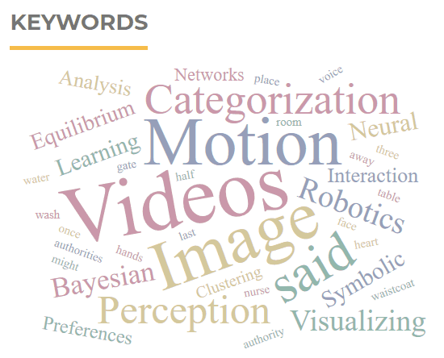

# Keyword Cloud Block Plugin
A sidebar block plugin for [Open Journal Systems](https://github.com/pkp/ojs) and [Open Monograph Press](https://github.com/pkp/omp) which displays a tag cloud of keywords.

## About
This plugin creates an additional sidebar block. When added to a sidebar, it displays a tag cloud of keywords of articles.

## License
This plugin is licensed under the GNU General Public License v2. See the file
COPYING for the complete terms of this license.

## Install
 * Go to Settings -> Website -> Plugins ->  Plugin Gallery -> Click in **Keyword Cloud Plugin** -> Install.
 * In next page, enable the plugin.
 * Go to Settings -> Website -> Appearance -> Sidebar management -> and drag the "Keyword Cloud Plugin" to the sidebar section.

## Compatibility
This plugin is compatible with OJS and OMP 3.2.0.0, 3.2.1.0 and 3.3.0.

## Credits

Maintained by the Lepidus team.

Originally developed by Alireza Sokhandan at https://github.com/ali-sokhandan/ojs3-keywordcloud-plugin
